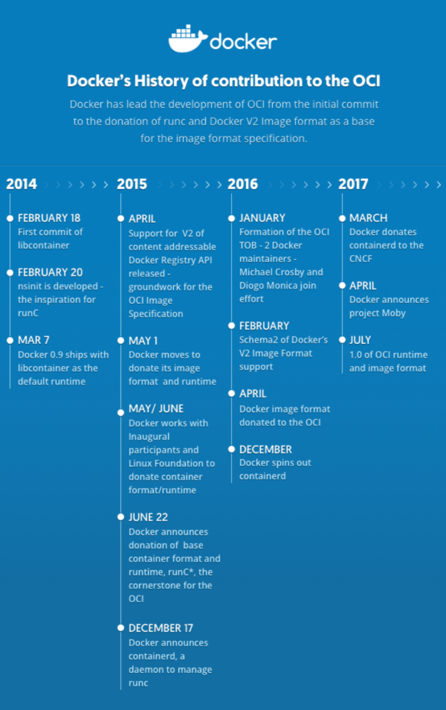

# INSTALATION ON LINUX
## 1. SSH Instalation on Ubuntu
>`sudo apt-get update`\
>`sudo apt list --upgradable`\
>`sudo apt-get upgrade`\
>`sudo apt-get dist-upgrade`\
>`sudo apt install openssh-server`\
>`sudo systemctl status ssh`\

>`sudo ufw status`\
>`sudo ufw enable`\
>`sudo ufw allow ssh`\

>`sudo ufw status`\

> `ip address`\

> `ssh devops@192.168.100.10` # ssh devops@localhost\
\
> > `exit`

> `reboot`

>`do-release-upgrade`\

> `sudo systemctl stop ssh`

> `sudo systemctl start ssh`

> `sudo systemctl enable ssh` # sudo systemctl disable ssh

>`sudo apt list --upgradable`\
>`sudo apt-get upgrade`\
>`sudo apt-get dist-upgrade`
## 2. WHAT IS DOCKER
Docker Container tanıtım videosu
[The future of Linux Containers](https://www.youtube.com/watch?v=wW9CAH9nSLs)

### 2.1 INSTALL DOCKER ENGINE on Ubuntu
[Install Docker Engine on Ubuntu](https://docs.docker.com/engine/install/ubuntu/).\
[Docker Engine release notes](https://docs.docker.com/engine/release-notes/)

Docker kurulumuna sahip değilseniz aşağıdaki linkten docker üzerinde çalışabilirsiniz.
[play-with-docker](https://labs.play-with-docker.com/)

## NOT: Yukarıdaki gibi bir hata ile karşılaşmak istemiyorsanız docker kurulumunu mutlaka `sudo su` ile root kullanıcısına geçtiktan sonra kurulum komutlarını uygulayın.

1. Eski sürümü kaldırmak için kullanılır.\
`sudo su`\
`sudo apt-get remove docker docker-engine docker.io containerd runc`

2. Apt paketlerini güncelleyiniz.\    
`sudo apt-get update`

3. Gerekli paket kurulumlarını yapınız.\
<pre>
sudo apt-get install \
    ca-certificates \
    curl \
    gnupg \
    lsb-release
</pre>

4. Docker'ın resmi GPG anahtarını ekleyin\
`sudo mkdir -p /etc/apt/keyrings`   
`curl -fsSL https://download.docker.com/linux/ubuntu/gpg | sudo gpg --dearmor -o /etc/apt/keyrings/docker.gpg`

5. En son kararlı sürümü apt-get ile kurabilme için kullanabilmek için yazılım deposunu apt-get listesine eklemiş olduk.\
<pre>
echo \
  "deb [arch=$(dpkg --print-architecture) signed-by=/etc/apt/keyrings/docker.gpg] https://download.docker.com/linux/ubuntu \
  $(lsb_release -cs) stable" | sudo tee /etc/apt/sources.list.d/docker.list > /dev/null
</pre>

6. apt paketlerini güncelleyiniz.\
`sudo apt-get update`

7. Docker engine ve docker containerin son sürümlerini yükleme\
`sudo apt-get install docker-ce docker-ce-cli containerd.io docker-compose-plugin`
  
NOT: `apt-cache madison docker-ce` komutu ile Docker Engine'in belirli bir sürümünü yüklemek için depodaki kullanılabilir sürümleri listelemek için kullanılır. `sudo apt-get install docker-ce=<VERSION_STRING> docker-ce-cli=<VERSION_STRING> containerd.io docker-compose-plugin` komutu ile istenilen sürüm yüklenebilir.

8. Docker yüklenip yüklenmediğinin kontrolü \
`sudo docker --version`

9. docker durum bilgisi kontrol edilir.\
`sudo systemctl status docker`

10. docker servisi yeniden başlatılır. \
`sudo service docker start`

11. Paket yükleme\
`sudo apt-get install -y uidmap`

12. Belirli bir kullanıcı ile docker çalıştırma için config yükleme\
`dockerd-rootless-setuptool.sh install`

13. Güvenlik açısından root kullanıcısı yerine farklı bir kullanıcı ile docker kullanılması tercih edilmelidir. $USER ifadesi istenilen username ile değiştirilebilir. \
`sudo usermod -aG docker $USER`

14. docker servisi yeniden başlatılır.\
`sudo systemctl restart docker`

15. docker durum bilgisi kontrol edilir.\
`sudo systemctl status docker`

16. Bilgisayar restart edilir.\
`sudo reboot`

*17. En kısa kurulum. Eski sürümleri yükler. docker-compose ve docker-machine komutlarını kullanabilmek için bu şekilde yükleme yapılabilir. BU YÜKLEME İSTEĞE BAĞLIDIR.*\
`sudo snap install docker`\
`sudo apt-get install -y uidmap`\
`dockerd-rootless-setuptool.sh install`

*NOT: alternatif install [Install using the convenience script](https://docs.docker.com/engine/install/ubuntu/#install-using-the-convenience-script)*
`sudo snap install curl`\
`curl -fsSL https://get.docker.com -o get-docker.sh`\
`DRY_RUN=1 sh ./get-docker.sh`\
`sudo sh get-docker.sh`\
`sudo apt-get install -y uidmap`\
`dockerd-rootless-setuptool.sh install --force`\
`sudo apt-get update`\
`sudo apt-get install virtualbox`\
`sudo snap install docker`
`sudo apt-get install virtualbox—ext–pack`

# DOCKER IMAGE
[Docker Tutorials and Labs](https://github.com/docker/labs) \
https://hub.docker.com/ \
https://hub.docker.com/publishers/microsoftowner \
https://mcr.microsoft.com/en-us/ \
https://console.cloud.google.com/gcr/images/google-containers 
  

Bir yazılımın çalışması için gerekli tüm dosyaları, kodları, kütüphaneleri içeren paketlere`image` diyoruz.

Popüler olarak kullanılan birçok uygulamanın resmi imajları kendi üreticisi tarafından [Docker Hub](https://hub.docker.com/search?q=) üzerinde yayınlanmaktadır.

| Command        | Description |
| -------------- | ----------- |
| `docker version`  | Docker Engine yüklü bilgisayarın hangi versiyon ve hangi işletim sistemi üzerine konumlandığı bilgileri gösterilir.. [docker version](https://docs.docker.com/engine/reference/commandline/version/)|
| `docker info`  | Docker kurulumu ile ilgili sistem genelindeki bilgileri gösterir. [docker info](https://docs.docker.com/engine/reference/commandline/info/)|
| `docker images`  | Yüklü imajları listelemek için kullanılır [docker images](https://docs.docker.com/engine/reference/commandline/images/) |
| `docker image ls`   | Yüklü imajları listelemek için kullanılır.  **REPOSITORY:** hangi repodan çekildiği bilgisini gösterir.  **TAG**: imajın versiyonunun gösterir.  **IMAGE ID:** her docker için farklı bir kimlik olup 64 karakterden oluşur. İlk 12 karakteri gösterilir. İmajın 12 karakterlik kısmı kullanılarak da işlem yapılabilir.  **CREATED:** imajın oluşturulduğu tarihi gösterir.  **SIZE:** imajın toplam boyutunu gösterir.    NOT: ID numaraları ile işlem yaparken hızdan tasarruf etmek adına kimlik numarasının benzersiz olan ilk karakterleri kullanılarak da imaj üzerinde işlem yapılabilir. [docker image](https://docs.docker.com/engine/reference/commandline/image/) \|[docker image ls](https://docs.docker.com/engine/reference/commandline/image_ls/)|
| `docker image ls -q` | Yüklü imajların ID numaralarını listelemek için kullanılır. |
| `docker image pull <<image_name>>`  | Docker Hub üzerinde yer alan imajı yerel sisteme çekmek için kullanılır. [docker image pull](https://docs.docker.com/engine/reference/commandline/image_pull/)|
| `docker images \| grep -A2 postgres`  | postgress imajından önce yüklenmiş son 2 image yi gösterir. Toplamda 3 image gösterecektir. |
| `docker images \| grep -B2 postgres`  | postgress imajından sonra yüklenmiş 2 image yi gösterir. Toplamda 3 image gösterecektir. |
| `docker image pull alpine:latest`  | : öncesi repository adını sonra gelen tag bölümü de imaja ait versiyonu göstermektedir. TAG bölümü belirtilmez ise latest kabul edilir.   **NOT:** latest ifadesi güncel imajı işaret ettiğini garanti etmez. |
| `docker image pull alpine`  | : öncesi repository adını sonra gelen tag bölümü de imaja ait versiyonu göstermektedir. TAG bölümü belirtilmez ise latest kabul edilir. NOT: latest ifadesi güncel imajı işaret ettiğini garanti etmez. |
| `docker image pull alpine:3`  | : öncesi repository adını sonra gelen tag bölümü de imaja ait versiyonu göstermektedir. |
| `docker image pull alpine -a`  | -a parametresi ile bir imajın bütün versiyonları indirilebilir. |
| `docker image pull gcr.io/google-containers/busybox`  | hub.docker.com dışındaki bir repository üzerinden [google busybox](https://console.cloud.google.com/gcr/images/google-containers/global/busybox) image download edilmesi.|
| `docker image inspect nginx:latest`  | belirtilen imaj ile ilgili ayrıntılı bilgi gösterir. [docker image inspect](https://docs.docker.com/engine/reference/commandline/image_inspect/) |
| `docker image rm nginx:latest`  | imaj_name olarak belirtilen imajı siler.  **NOT**: Bir container a ait imaj silinemez. Öncesinde imajın bağlı bulunan container ın durdurulması gereklidir. [docker image rm](https://docs.docker.com/engine/reference/commandline/image_rm/) |
| `docker rmi alpine:3`  | Belirtilen imajı siler. [docker rmi](https://docs.docker.com/engine/reference/commandline/rmi/) |
| `docker rmi $(docker image ls -q) --force`  | Bütün imajları silmek için kullanılır. [docker rmi](https://docs.docker.com/engine/reference/commandline/rmi/) |
| `docker images --filter "dangling=true"`  | TAG verisi olmayan imajları listelemek için kullanılır. [docker images Filtering](https://docs.docker.com/engine/reference/commandline/images/#filtering) |
| `docker rmi $(docker images -f "dangling=true" -q)`  | TAG verisi olmayan imajları silmek için kullanılır. [docker images Filtering](https://docs.docker.com/engine/reference/commandline/images/#filtering) |
| `docker image prune` | Geçmişe yönelik kullanılmayan imajları silmek için kullanılır. Prune paremetresinin rm den farkı *dangling* modunda olan yani bir etikete (tag) sahip olmayan imajların tamamını siler. [docker image load](https://docs.docker.com/engine/reference/commandline/image_load/) |
| `docker image prune -a` | Geçmişe yönelik kullanılmayan ve referans verileyen imajları silmek için kullanılır.(-a  --all) [docker image prune](https://docs.docker.com/engine/reference/commandline/image_prune/) |
| `docker image prune -a --force --filter "until=24h"` | Son 24 saate oluşturulmuş imajları siler. [docker image prune](https://docs.docker.com/engine/reference/commandline/image_prune/) |
| `docker images --filter label="maintainer"`  | Label olarak verilen key value şeklindeki veriye göre filtreleme yapar. `docker image inspect nginx:latest` ile label isimleri görüntülenebilir. [docker images Filtering](https://docs.docker.com/engine/reference/commandline/images/#filtering) |
| `docker image history nginx:latest`  | Belitilen imaj üzerindeki katmanları(layer) boyut bilgisi ile gösterir. [docker image history](https://docs.docker.com/engine/reference/commandline/image_history/) |
| `docker image tag node:latest node-world:v3` | nginx:latest imajından nginx:v1 etiketi ile yeni bir tane oluşturur. [docker image tag](https://docs.docker.com/engine/reference/commandline/image_tag/) |
| `docker images \| grep node-world` | docker imajlarında node+world olarak isimlendirilmiş imajlar gösterilir. [docker image tag](https://docs.docker.com/engine/reference/commandline/image_tag/) |
| `docker image save nginx:latest > nginx_later.tar` | nginx:v2 imajının tar arşivi olarak kaydedilmesini sağlar. [docker image save](https://docs.docker.com/engine/reference/commandline/image_save/) |
| `docker image load --input nginx_later.tar` | Arşiv olarak kaydedilen imajların geri yüklenmesini sağlar. [docker image load](https://docs.docker.com/engine/reference/commandline/image_load/) |
| `docker login` | Hub.docker.com üzerinde sistemimizin login olması için kullanılır. [docker login](https://docs.docker.com/engine/reference/commandline/login/) |
| `docker image tag alpine:latest esaydam/alpine5:v1`  `docker tag alpine:latest esaydam/alpine5:v1` | alpine:latest imajını esaydam/alpine5:v1 olarak işaretler. [docker image tag](https://docs.docker.com/engine/reference/commandline/image_tag/) |
| `docker image push esaydam/alpine5:v1`   `docker push esaydam/alpine5:v1`| Hub.docker.com üzerinde bulunan repository'ye imajı göndermek için kullanılır. [docker image push](https://docs.docker.com/engine/reference/commandline/image_push/) |

# DOCKER CONTAINER
Bir container bir imajın çalışır durumdaki halidir. Bir imajdan birden çok container çalıştırılabilir. 

Sanal makine ile container teknolojisinin fark; sanal makine bir işletim sisteminin bütününü çalıştırırken, container konumlandığı işletim sisteminin çekirdeğini paylaşarak sanal makineye göre daha hızlı çalışacaktır.

| Command        | Description |
| -------------- | ----------- |
| `docker container ls`  `docker ps`  `docker container ls -a`  `docker ps -a`  | Çalışan containerları göstermek için kullanılır. [docker container ls](https://docs.docker.com/engine/reference/commandline/container_ls/)|
| `docker container run alpine:latest ls -a`  | Belirtilen imaj içerisinde ls -a komutunu çalıştırır ve container çalışmasını durdurur. docker container [docker container run](https://docs.docker.com/engine/reference/commandline/container_run/)   *Image üzerinden bir container yaratıldığı zaman varsayılan olarak çalıştırılması için ayarlanmış bir uygulama vardır. Bu uygulama çalıştığı sürece container ayakta kalır. Uygulama çalışmasını sonlandırdığında container da kapatılır.*    *Docker container çalıştırıldığında-başlatıldığında image içerisinde birden fazla uygulama barındırsa da sadece tek bir uygulamanın otomatik olarak çalıştırılmasına izin verir.*    *varsayılan olarak çalıştırılması öngörülen image ile beraber gelen uygulamayı container oluşturulurken değiştirebiliriz.*   Container ismi verilmez ise ilk kısım ingilizce sıfatlardan oluşuran, İkinci kısım ise bilişim dünyasındaki tanınan isimlerden oluşan bir isim verilir. İsimlendirme ile ilgili detaylı bilgi için [names-generator.go](https://github.com/moby/moby/blob/master/pkg/namesgenerator/names-generator.go)  |
| `docker container run --name calpine -d -it alpine sh`  | Belirtilen `sh` komutu `-d --detach` `-i --interactive` ve `-t --tty` modda çalıştırılır. Burada çalıştırılan uygulama PID id 1 ile container içerisinde çalışmaya devam eder. docker da bu PID id yi izleyerek container yaşamına devam ederi.  |
| `docker container run -dt -p 80:80 --restart always --name nginxcontainer nginx`  | `--restart always` container bilinmeyen bir nedenden dolayı kapatılsa dahi tekrar başlatılması sağlanmış olur. |
| `docker container kill -s 9 centoscon`  | Belirtilen container sonlandırmak için değer gönderir. [docker container kill](https://docs.docker.com/engine/reference/commandline/kill/) [SIGNAL](https://man7.org/linux/man-pages/man7/signal.7.html) .   Linux üzerinde `kill -l` signal değerleri buradan da görüntülenebilir.   `ps aux` yada `ps` komutu ile PID id ler görüntülenebilir. |
| `docker container run --interactive --tty  centos /bin/bash`  `docker container run -it centos /bin/bash`   **`docker run -itd centos /bin/bash`** | **-i --interactive**=> interactive terminal   **-t -tty** => TTY pseudo terminal.   Belirtilen imaj başlatılır ve bash kabuğu üzerinden sanal bir terminal üzerinden etkileşimli bağlantı oluşturulurur.   Centos imajı üzerinden bir container ayağa kaldırır ve interaktif bash ile ona bağlanır.   **NOT:**   - **CTRL+Q+P** tuş kombinasyonu ile çıkış yapılabilir. Bu kombinasyonla çıkış yapılması **containerin çalışmasını durdurmaz.**   - Bash kabuğunda çalışırken **exit** komutu ile çıkılabilir. Bu **bash kabuğunun sonlanmasına neden olur**. [docker container run](https://docs.docker.com/engine/reference/commandline/container_run/) |
| `docker container stats 33c657b76ca8` | Çalışan Containerın kaynak kullanımını gösterir. [docker container stats](https://docs.docker.com/engine/reference/commandline/container_stats/) |
| `docker container attach 78b324e4e06c`  `docker attach 78b324e4e06c` | Çalışan container a bağlanılmasını sağlar. [docker container attach](https://docs.docker.com/engine/reference/commandline/container_attach/) |
| `docker container rm ebbfd968b330`   `docker container rm ebbfd968b330 -f`| container i siler.    *container silinmesi için durmuş olması gerekir.*   **-f --force** parametresi ile çalışan kontainer da silinir. [docker container rm](https://docs.docker.com/engine/reference/commandline/container_rm/)|
| `docker container run --interactive --tty --detach centos /bin/bash`   `docker container run -itd centos /bin/bash`| Konteynerin arka planda çalıştırılmasını sağlar. [docker container run](https://docs.docker.com/engine/reference/commandline/container_run/)|
| `docker container commit 092 new_centos`| Varolan bir container üzerinden yeni bir imaj oluşturur ve yerel olarak images arasına kaydeder.  [docker container commit](https://docs.docker.com/engine/reference/commandline/container_commit/) |
| `docker container cp 092:/liste.txt .` | Belirtilen container içindeki dosyaları bulunulan dizine kopyalar. Container silinmemiş olması gereklidir. Container kapalı yada durdurulmuş olabilir. **cp komutu durdurulmuş container içinde uygulanabilir.** [docker container cp](https://docs.docker.com/engine/reference/commandline/container_cp/) |
| `docker container create centos` | Belirtilen imajdan bir container oluşturur. [docker container create](https://docs.docker.com/engine/reference/commandline/container_create/)   **NOT:** Eğer imaj local de yoksa hub.docker.com üzerinden indirir.|
| `docker container diff 36` | Belirtilen container_name dosya sistemi üzerindeki dosyalarda veya klasörlerde yapılan değişiklikleri gösterir. [docker container diff](https://docs.docker.com/engine/reference/commandline/container_diff/) |
| `docker container exec 36 cat /etc/resolv.conf` | Belirtilen containerid si üzerinde bir komut(cat gibi) çalıştırmak için kullanılır. [docker container exec](https://docs.docker.com/engine/reference/commandline/container_exec/) |
| `docker container run --name cnginx -d -it -p 80:80 nginx`    `docker container exec -it cnginx bash` |Çalışan bir container üzerinde bash çalıştırarak terminalden bağlantı kuracaktır. [docker container exec](https://docs.docker.com/engine/reference/commandline/container_exec/) |
| `docker container export 36 --output exportcentos.tar`  `docker container export 36 -o exportcentos.tar` | Çalışan bir containerı tar dosyası olarak export eder. [docker container export](https://docs.docker.com/engine/reference/commandline/container_export/) |
| `docker container inspect 36` | Çalışan bir container hakkında bilgi verir. [docker container inspect](https://docs.docker.com/engine/reference/commandline/container_inspect/) |
| `docker container kill 36` | Belirtilen container idsini durdurur. [docker container kill](https://docs.docker.com/engine/reference/commandline/container_kill/)  |
| `docker container logs 36` | Belirtilen containerın loglarını gösterir. shell ekranındaki kullanılan komutların listesini gösterir.[docker container logs](https://docs.docker.com/engine/reference/commandline/container_logs/) |
| `docker container ps`    `docker container ls`| Yerel sistemdeki containerleri listeler. [docker container ls](https://docs.docker.com/engine/reference/commandline/container_ls/) [docker container ps](https://docs.docker.com/engine/reference/commandline/ps/)|
| `docker container pause 7a`| Belirtilen containeri geçici olarak durdurur. Tarayıcıdan container a port üzerinden bağlanmaya kalkılırsa tima out (zaman aşımı) hatası aldığınız göreceksiniz. Yaratılan container publish portunu tutmaya devam ederken duraklatıldığı için isteklere cevap veremiyor.  [docker container pause](https://docs.docker.com/engine/reference/commandline/container_pause/) |
| `docker container unpause 33c657b76ca8`| Durdururmuş container ı tekrar çalıştırır. [docker container unpause](https://docs.docker.com/engine/reference/commandline/container_unpause/) |
| `docker container restart 7a`| Durdururmuş container ı tekrar çalıştırır. [docker container restart](https://docs.docker.com/engine/reference/commandline/container_restart/) |
| `docker container prune`| Durdurulmuş stop edilmiş (kill komutu ile - pause edilmişleri silmez.) containerleri siler. [docker container prune](https://docs.docker.com/engine/reference/commandline/container_prune/) |
| `docker container rename wonderful_varahamihira c_centos`| Container ismini değiştirir. [docker container rename](https://docs.docker.com/engine/reference/commandline/container_rename/)  |
| `docker container stop fa`| Belirtilen containerın çalışmasını durdurur. Durdurulan container ın kullandığı bir publish port var ise artık kullanılabilir olacaktır. [docker container stop](https://docs.docker.com/engine/reference/commandline/container_stop/) |
| `docker container ls -a --filter status=exited`| Durdurulmuş konteynerlerin listelenmesini sağlar. [docker container ls](https://docs.docker.com/engine/reference/commandline/container_ls/) |
| ` docker container rm -f $(docker container ls -a -q)`   ` docker rm -f $(docker ps -qa)`| Çalışan yada durdurulmuş bütün containerları silmek için kullanılır. |
| `docker container rm $(docker container ls -a --filter status=exited --quiet)`| Durdurulmuş konteynerlerin tamamının silinmesini sağlar. [docker container ls](https://docs.docker.com/engine/reference/commandline/container_ls/) |
| `docker container start fa`| Belirtilen durmuş (stop) containerı çalıştırır. [docker container start](https://docs.docker.com/engine/reference/commandline/container_start/) |
| `docker container port 660c0b8819d0`| Belirtilen containerın port maping bilgilerini gösterir. [docker container port](https://docs.docker.com/engine/reference/commandline/container_port/) |
| `docker container rm 660c0b8819d0 -f`| Belirtilen container veya containerları force (-f) silmeye zorlar. [docker container rm](https://docs.docker.com/engine/reference/commandline/container_rm/) |
| `docker container run --rm -it alpine sh`| Paremetre olarak `--rm` ile başlatılan container durdurulduğu anda containerın silinmesi sağlanır. [docker container run](https://docs.docker.com/engine/reference/commandline/container_run/)|
| `docker container top 33c657b76ca8`| Belirtilen container için çalışan programları gösterir. [docker container top](https://docs.docker.com/engine/reference/commandline/container_top/) |
| `docker container run -p 80:80 nginx`| Belirtilen container için bir isim verilir. İlk kısım ingilizce sıfatlardan oluşur. İkinci kısım ise bilişim dünyasındaki tanınan isimlerden oluşur. İsimlendirme ile ilgili detaylı bilgi için [names-generator.go](https://github.com/moby/moby/blob/master/pkg/namesgenerator/names-generator.go)  [docker container run](https://docs.docker.com/engine/reference/commandline/container_run/) |
| `docker container run --name cnginx -p 80:80 nginx`| Belirtilen container için cnginx isimi verilir. [docker container run](https://docs.docker.com/engine/reference/commandline/container_run/) |
| `docker container run -it --env ilkEnv=Degerim1 --env=ikinci=Degerim2 ubuntu bash`   `printenv`| Container oluşturulurken içerisinde kullanılacak environment oluşturularak işlem yapılması sağlanır. [docker container run](https://docs.docker.com/engine/reference/commandline/container_run/)     |
| `docker container run -it --env=USER ubuntu bash`| docker host üzerindeki varolan envronment variable ı container oluşturulurken liçerisinde kullanılacak environment olarak kullanılması sağlanabilir. [docker container run](https://docs.docker.com/engine/reference/commandline/container_run/)  |
| `docker container run -it --env-file env.list ubuntu bash`| Birden fazla environment variables tanımlaması yapabilmek için bir dosyada variable lar toplanıp container oluşturulurken `--env-file` tanımlaması yapılabilir. [docker container run](https://docs.docker.com/engine/reference/commandline/container_run/)  |

> ## **NOT: image üzerinden hareketle bir container çalıştırılırken `docker container run --name cnginx -p 80:80 -it nginx bash` şeklinde oluşturulan bir container nginx servisi çalıştırılmayacaktır. image içerisinde container oluşturma aşamasında varsayılan olarak çalışması düşünülen servis yerine bash kabuğunun çalışması sağlanmış olur.**

# DOCKER CONTAINER KAYNAK KULLANIMI
| Command        | Description |
| -------------- | ----------- |
| `docker top cnginx`  | Belirtilen container üzerinde çalışan uygulamaları görmek için kullanılır. Container içerisine girmemize gerek kalmadan çalışan uygulamalar görüntülenebilir. [docker top](https://docs.docker.com/engine/reference/commandline/top/)|
| `docker stats` | Herhangi bir container ismi verilmez ise o anda çalışan bütün containerların CPU RAM NETWORK ve DOSYA IO kullanımları ile ilgili bilgiyi ekranda gösterir. [docker stats](https://docs.docker.com/engine/reference/commandline/stats/)|
| `docker stats cnginx` | Belirtilen container ın ne kadar CPU RAM NETWORK ve DOSYA IO kullanımı ile ilgili bilgileri gösterir. [docker stats](https://docs.docker.com/engine/reference/commandline/stats/)|

Sistem üzerinde başlatılan container ihtiyaç duyduğu kaynakları host makinesi üzerinden kullanır. Performans anlamında bu iyi bir durum değildir. Kaynak kullanımının sınırlandırılması gerekmektedir. Container başlatılırken kaynaklar sınırlandırılabilir. 

https://docs.docker.com/config/containers/resource_constraints/

| Command        | Description |
| -------------- | ----------- |
| `--cpus=<value>`  | Bir container kullanabileceği mevcut CPU kaynaklarının ne kadarını kullanılacağını belirtir. Örneğin, ana makinenin iki CPU'su varsa ve --cpus="1.5" olarak ayarlarsanız, container ın CPU'ların en fazla bir buçuk tanesi garanti edilir. docker host üzerinde kaç tane core var ise onun sadece 1.5 tanesini kullanabilecektir. Bu, --cpu-period="100000" ve --cpu-quota="150000" ayarının eşdeğeridir. [Configure the default CFS scheduler](https://docs.docker.com/config/containers/resource_constraints/#configure-the-default-cfs-scheduler)|
| `--cpuset-cpus [<int>]` | `--cpus` ile belirtilen kullanılacak CPU ların hangilerinin olduğuna `--cpuset-cpus` ile karar verilir. Windows üzerinde task manager (görev yöneticisi) CPU seçeneği altında resource manager üzerindeki CPU tabında bulunan cpu ların 0 (sıfır) dan başlayarak docker host bilgisayarın kaç adet CPU bulunuyor ise (-1) ID numaraları ile cpu ataması yapılabilmesini sağlar. [Configure the default CFS scheduler](https://docs.docker.com/config/containers/resource_constraints/#configure-the-default-cfs-scheduler)|
| `--cpu-shares <int>`  | CPU kullanımının **bağıl değerini** gösterir. Varsayılan değeri 1024tür. [Configure the default CFS scheduler](https://docs.docker.com/config/containers/resource_constraints/#configure-the-default-cfs-scheduler)|
| `--memory <bytes>`  | RAM in sınırlandırılması için kullanılır NOT:  - bytes, kilobytes, megabytes, gigabytes olarak 4 farklı değer alır. Bunların kısaltmaları kullanılır. b, k, m, g - izin verilen minimum değer 6m(6 megabayt) olur. [Limit a container’s access to memory](https://docs.docker.com/config/containers/resource_constraints/#limit-a-containers-access-to-memory)|
| `--memory-swap <bytes>`  | `--memory-swap` değeri `--memory` değeri tanımlandı ise çalışacaktır. `--memory` değerinin tamamı tüketildiğinde bellek gereksinimi olduğu sürece diskin ne kadarlık bir alanının bellek olarak kullanılacağını belirtir. [--memory-swap details](https://docs.docker.com/config/containers/resource_constraints/#--memory-swap-details)|

| Command        | Description |
| -------------- | ----------- |
| `docker run --detach --interactive --tty --name kaynakGozlem --cpu-shares 256 --memory 1024M centos /bin/bash`  | Container için Cpu ve rem sınırlandırması sağlar. [docker container run](https://docs.docker.com/engine/reference/commandline/container_run/)|
| `docker container inspect d61967ef9e53`   `docker container inspect kaynakGozlem` | Belirtilen container ın detaylı configurasyon ayarları görüntüler. [docker container inspect](https://docs.docker.com/engine/reference/commandline/container_inspect/) |
| `docker run --name c_ninx --cpu-shares 512 -d nginx` | Nginx için kaynakların yarısı ayrılmıştır. [docker container run](https://docs.docker.com/engine/reference/commandline/container_run/)|
| `docker run --name c_redis --cpu-shares 512 -d redis` | Redist için kalan yarısı ayrılmıştır. [docker container run](https://docs.docker.com/engine/reference/commandline/container_run/)|
| `docker run --name c_ninx --cpus 0.5 -d nginx` | Bir çekirdeğin yarısı konteynere atanır. **NOT:** 	- cpus defauit değeri 0 dır. Bu kullanım oranında limit olmadığını gösteriri. [docker container run](https://docs.docker.com/engine/reference/commandline/container_run/)|
| `docker run --name c_redis --cpus 0.5 -d redis` | Bir çekirdeğin yarısı konteynere atanır. [docker container run](https://docs.docker.com/engine/reference/commandline/container_run/)|
| `docker container run -d --cpus=1.5 --cpuset-cpus 0,3 nginx` | Bir buçuk çekirdeğin kullanılabileceği ve bu cpu idlerinin 0 ve 3 olduğunu belirtmek için kullanılır. [docker container run](https://docs.docker.com/engine/reference/commandline/container_run/)|
| `docker run --name c_apline --memory 500m -ti -d alpine` | 500megabyte memory atanması (500MB = 500 x 1024 x 1024 = 524288000 bytes) [docker container run](https://docs.docker.com/engine/reference/commandline/container_run/)|
| `docker container run --memory 100MB --memory-swap 200MB -d nginx` | 100MB doldurulsa dahi swap alanından dolayı 200MB daha sistemden kullanabilecek. [docker container run](https://docs.docker.com/engine/reference/commandline/container_run/)|
| **`docker container update --cpu-shares 500 c_busybox`** | varolan ve çalışan bir container kaynağının güncelleştirilmesi. [docker container update](https://docs.docker.com/engine/reference/commandline/container_update/)  |
# ORNEKLER
[cowsay Dockerfile](/examDockerFiles/cowsay/Dockerfile) \
`docker image build --tag cowsaycontainer:latest .` \
`docker container run --rm cowsaycontainer /usr/games/cowsay -f 'turtle' 'Docker'`

`docker container run --memory 100MB -d nginx`\
`docker stats`
## CONTAINER YAŞAM DÖNGÜSÜ
`docker container run -it -d ubuntu /bin/bash` * **NOT**: -d --detach Containerarka planda çalıştırır.*   
`docker ps` \
`docker rename 0161efd6c7e9 c_ubuntu` \
`docker ps` \
`docker stop c_ubuntu` \
`docker ps` \
`docker ps -a` \
`docker start c_ubuntu` \
`docker exec c_ubuntu ls -al` \
`docker rm c_ubuntu` \
`docker rm c_ubuntu` \
`docker rm c_ubuntu -f` 

## ÇALIŞAN CONTAINER den IMAJ oluşturmak
**`docker container run -it -d centos /bin/bash`**\
**`docker ps`**\
**`docker rename dff867e25020 c_centos`**\
**`docker attach c_centos`**

>*`cd /etc/yum.repos.d/`\
>`sed -i 's/mirrorlist/#mirrorlist/g' /etc/yum.repos.d/CentOS-*`\
>`sed -i 's|#baseurl=http://mirror.centos.org|baseurl=http://vault.centos.org|g' /etc/yum.repos.d/CentOS-*`\
>`yum update -y`\
>`yum install wget`*\
[centos yum update](https://techglimpse.com/failed-metadata-repo-appstream-centos-8/)

**`docker diff c_centos`** * **NOT**:Containerdaki değişikliklerin takip edilmesi*   
**`docker commit c_centos mynewcentos`**\
**`docker image ls`**\
**`docker ps`**\
**`docker rm c_centos -f`**\
**`docker run -it -d mynewcentos /bin/bash`**\
**`docker ps`**

# VOLUME ILE CALISMAK
[Use volumes](https://docs.docker.com/storage/volumes/)\
Container dışında veri saklamak için kullanılır. Bir containerda sorun olduğunda yeni bir container oluşturup aynı volume kullanmasını sağlayabiliriz.

Farklı container lar arasında yaratılan bir volume ortak olarak kullanılabilir.

1. Eğer bir volume container içerisine mount edildiğinde image içerisinde mount edildiği klasör mevcut değil ise klasör yaratılır ve volume içerisinde hangi dosyalar var ise o dosyalar görüntülenir.

2. Bir volume imaj içerisinde mevcut bir klasöre mount edilir ise: \
a. image içerisindeki klasör boş veya dosya var ise volume içerisinde hangi dosya var ise o dosyalar görüntülenir.\
b. image içerisinde ki klasörde dosya var ise ve volume boş ise bu sefer o klasördeki dosyalar volume kopyalanır.

[bind-mounts](https://docs.docker.com/storage/bind-mounts/)\

| Command        | Description |
| -------------- | ----------- |
| `docker volume create`  | Docker volume bağlantı noktası oluşturur. Bu bağlantı ismi 64 karakterden oluşan bir hex bilgisi volume ismini oluşturur. [docker volume create](https://docs.docker.com/engine/reference/commandline/volume_create/)|
| `docker volume create --name volumeTest`  | Yeni bir volume yaratırken isim verilerek bir volume yaratılır.  [docker volume create](https://docs.docker.com/engine/reference/commandline/volume_create/)|
| `docker volume inspect volumeTest`    `docker inspect volumeTest` | Belirtilen volume ile ilgili detay bilgi gösterir. [docker volume inspect](https://docs.docker.com/engine/reference/commandline/volume_inspect/) |
| `docker volume ls` | Belirtilen volume ile ilgili detay bilgi gösterir. [docker volume ls](https://docs.docker.com/engine/reference/commandline/volume_ls/)|
| `docker volume rm 649518d850bcc5`    `docker volume rm volumeTest` | Belirtilen volume ile silinir. Dikkat edilmesi gereken nokta çalışan container a bağlı bir volume silinemez. [docker volume rm](https://docs.docker.com/engine/reference/commandline/volume_rm/)|
| `docker volume prune` | Herhangi bir container a bağlı olmayan volume ler siliniz. [docker volume prune](https://docs.docker.com/engine/reference/commandline/volume_prune/)|
| `docker container run -v /home/devops/hostdir/:/serverdir/ -w /serverdir -t -i ubuntu bash` | Docker host üzerindeki bir klasörü docker container içerisinden erişilebilir hale getirmek. [docker container run](https://docs.docker.com/engine/reference/commandline/run/)|
| `docker volume create ilkvolume`    `docker container run -it -v ilkvolume:/deneme3:ro ubuntu sh` | Daha önce oluşturulmuş `ilkvolume` adındaki volume yi read only olarak oluşturulacak olan container ile kullanılması sağlamak. [docker container run](https://docs.docker.com/engine/reference/commandline/run/)   |
| `docker container run --name cnginx -d -it -p 80:80 -v /mnt/hgfs/DEV/:/usr/share/nginx/html nginx` | Bind mounts yöntemi kullanılarak docker host üzerindeki bir klasörü docker container içerisindeki klasöre mount etmek. Bu yöntem production ortamında kullanılmamalıdır. Bunun yerine volume mount işlemi kullanılmalıdır. [bind-mounts](https://docs.docker.com/storage/bind-mounts/)|

# CONTAINER KAYNAKLARININ GUNCELLENMESI

`docker container run --name c_busybox -it --cpu-shares 700 busybox`\
`docker ps`\
`docker container inspect c_busybox | grep CpuSha`\
**`docker container update --cpu-shares 500 c_busybox`**

# DOCKER PLUGIN-DRIVER
[Use Docker Engine plugins](https://docs.docker.com/engine/extend/legacy_plugins/#use-docker-engine-plugins)\

# BASH script dili kullanılarak birden fazla container oluşturmak.
`for number in {1..3};do docker container run -ti -d --name sunucu${number} alpine; done;`

# Araştırma Konusu
Bocker