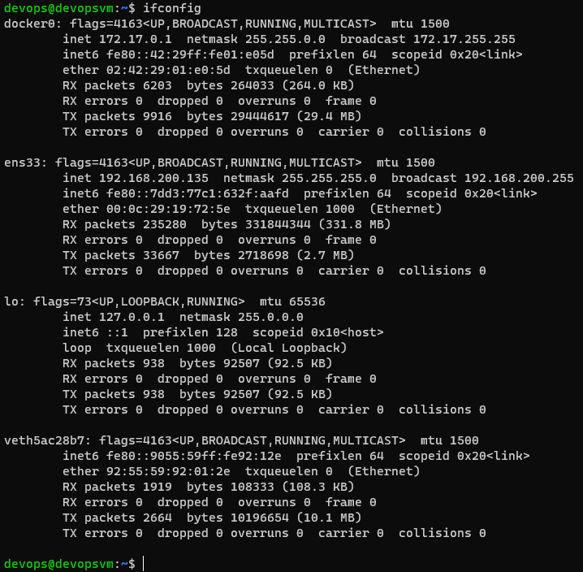
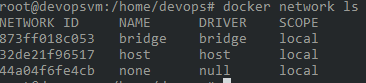
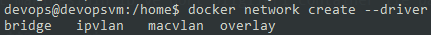
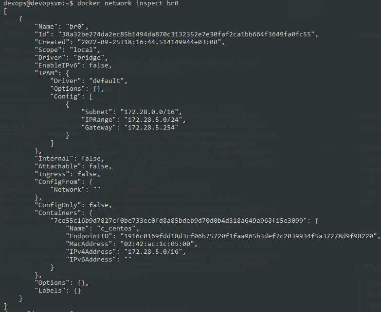
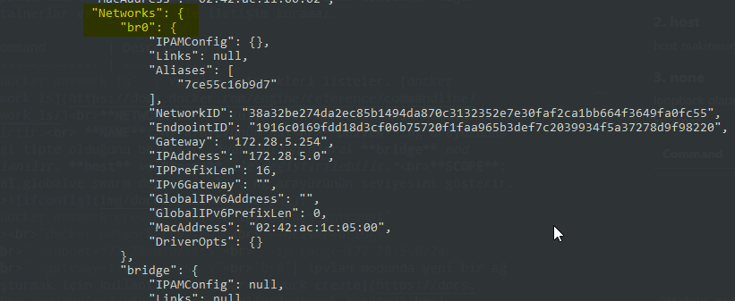

# [DOCKER NETWORK](https://docs.docker.com/engine/reference/commandline/network/)

docker container seviyesinde network yönetmek için kullanılır.\
Ethernet Bridge arayüzü **docker0** adıyla gelir. Host tarafından docker0 kontrol edilerek görüntülenebilir. 

- **default bridge networkü üzerinde dns desteği yoktur.** Ancak kullanıcı tanımlı bridge networkü oluşturulduğunda docker container ismi ile containerların birbirleri arasında haberleşsin diye basit olarak bir dns kurulur ve container isimleri üzerinden işlem yapılması sağlanır.*\

## DOCKET NETWORK TİPLERİ

[Network containers](https://docs.docker.com/engine/tutorials/networkingcontainers/)

 \
Docker kurulumu ile beraber gelen varsayılan olarak 3 farklı ağ bulunur. Docker üzerindeki o anda bulunan networkleri listelemek için `docker network ls` komutu kullanılır. \

### **1. bridge**
IP, subnet ve gateway otomatik olarak container a atanır. container dış dünya ile host üzerinden internet ile haberleşebilir. Container içerisinden dış ağa çıkılması için arada NAT (Network Address Translation) olduğu söylenilebilir. Ancak dış dünyadan bu container a erişilebilmesi için port yönlendirmesi yapılması gerekir.

**NOT**:*bridge modunda kullanılan container lar birbirleri ile haberleşebilir.*

Container IP lerini belirlemek için ayrıca DHCP (Dynamic Host Configuration Protocol) sunucusu kurmamıza gerek yoktur. Docker IP ataması işlemlerini kendisi yönetir. Otomatik olarak 172.17.0.0/16 subnet ine ait IP adresleri dağıtılır. Aşağıdaki komut kullanılarak bu görüntülenebilir. \
`docker network inspect bridge` \

NOT: `docker container run` veya `docker run` komutu kullanıldığında oluşturulan container varsayılan olarak `bridge` network üne dahil edilir. \
`docker run --rm --network bridge -ti centos bash` \
`ip addr` \

- **default bridge networkü üzerinde dns desteği yoktur.** Ancak kullanıcı tanımlı bridge networkü oluşturulduğunda docker container ismi ile containerların birbirleri arasında haberleşsin diye basit olarak bir dns kurulur ve container isimleri üzerinden işlem yapılması sağlanır.*

Bridge network driver kullanılarak farklı iki networkler oluşturulmuş olsun. Oluşturacağımız container ın biri bir network diğeride diğer network e dahil olacak şekilde çalıştırdığımızı düşünün. Birbirlerine ping atmak istediklerine atamayacakları bilinmelidir.

 \
 \

### **2. host**
 \
host makinesinin ip ve port bilgileri container ile paylaşılır. \
`docker run --rm --network host -ti centos bash` \
`ip addr` \

Docker host makinasının IP bilgileri :\

### **3. none**
loopback olarak kullanılmasını sağlar. Bu durumda container diğer containerlar ve dış dünya ile iletişim kuramaz. \
`docker run --rm --network none -ti centos bash` \
`ip addr` \

### **4. overlay**
bridge (köprü) ağları tek bir docker host üzerinde istediğimiz izalasyonu ve ağ yapılandırmasını sağlamak için işimizi görmektedir. Ancak birden fazla docker host bulunduğu bir ortamda kendi aralarında haberleşmek için yeterli olmamaktadır.

Eğer Docker Swarm aktif edildi ise overlay driver ı ile oluşturulmuş bir ağ yapılandırılmış olarak gelmektedir. Bu sürücü VXLAN (Virtual Extensible LAN) olarak adlandırılır.

VXLAN - Virtual Extensible LAN :Bu ağ çeşidi kullanılarak IP katmanlarının üstünde UDP paketleri içerisinde ETHERNET paketleri gönderilerek farklı komunlarda bulunan bilgisayarların aynı fiziksel ortamda, aynı switch üzerinde bağlı bilgisayarlarmış gibi birbirleri ile haberleşmesini sağlamak için kullanılan bir teknolojidir.

VXLAN üzerinde oluşturulmuş olsa bile farklı ağlar üzerine eklenmiş olan containerları birbirlerini göremeyecek şekilde yapılandırmayıda desklediği gibi, yük dengelemek için DNS Round Robin veya IPVS (IP Virtual Server) desteklemesi, service discovery gibi teknolojileri desteklemesi ve docker üzerinde key-value storage olarak saklanması ayrıca bir kurulum gerektirmemesi gibi ek özellikleride barındırmaktadır.

| Command        | Description |
| -------------- | ----------- |
| `docker network ls`  | Varolan networkleri listeler. [docker network ls](https://docs.docker.com/engine/reference/commandline/network_ls/) **NETWORK ID** : Kullanılan ağ arayüzünün kimliğini belirtir.  **NAME**: Ağ arayüzünün adı **DRIVER**:Ağ arayüzünün hangi tipte olduğunu belirtir. *Varsayılan olarak **bridge** mod kullanılır. **host** ve **none** ile değiştirilebilir.* **SCOPE**: local,globalve swarm değerini alır. Ağ arayüzünün seviyesini gösterir. |
| `docker network create --driver ipvlan net_intranet`   `docker network create \` `--driver=bridge \` `--subnet=172.28.0.0/16 \` `--ip-range=172.28.5.0/24 \` `--gateway=172.28.5.254 \` `br0`| ipvlan modunda yeni bir ağ oluşturmak için kullanılır. [docker network create](https://docs.docker.com/engine/reference/commandline/network_create/) |
| `docker network inspect br0`| br0 isimli network hakkında json formatında detaylı bilgi verir. [docker network inspect](https://docs.docker.com/engine/reference/commandline/network_inspect/) |
| `docker network connect br0 c_centos`| Belirtilen containerı belirtilen networke bağlar. Otomatik olarak ip adresi sistem tarafından verilir. [docker network connect](https://docs.docker.com/engine/reference/commandline/network_connect/)|
| `docker network disconnect bridge c_centos`|Bridge networkünden belirtilen konteynerın network bağlantısını iptal eder. [docker network disconnect](https://docs.docker.com/engine/reference/commandline/network_disconnect/)|
| `docker network rm br0`|Varolan ağı siler. Silinmesi için herhangi bir container e connect olmaması gereklidir. [docker network rm](https://docs.docker.com/engine/reference/commandline/network_rm/)|
| `docker container inspect c_ubuntu \| grep IPAd`|Belirtilen container a ait ip adreslerini kısadan yoldan listeler. [docker container inspect](https://docs.docker.com/engine/reference/commandline/container_inspect/)|
| `docker container run -it --name net_host_nginx --network host nginx bash`|Bir container yaratarak interactive modda terminal bağlantısı yaparak docker host networkleri ile aynı ayarları kullacak şekilde bir container ayağa kaldırılıyor.|
| `docker container run -it --name host_net_nginx --network none nginx bash`|Bir container yaratarak interactive modda terminal bağlantısı yaparak internet bağlantısı olmadan bir container ayağa kaldırılıyor.|

## ORNEK
> c_centos container ına br0 networkü bağlamak.\
`docker network create --driver=bridge --subnet=172.28.0.0/16 --ip-range=172.28.5.0/24 --gateway=172.28.5.254 br0`\
`docker network connect br0 c_centos`\
`docker container inspect c_centos`\

Örnek networkler yaratıp containerlar aynı networkte ise birbirleri ile haberleştiğinin kanıtı aşağıdadır.
>`docker network create netbridge1`\
`docker network create netbridge2`\
`docker container run --name c_ubuntu --network netbridge1 -ti -d ubuntu bash`\
`docker container run --name c_nginx --network netbridge2 -d nginx`\
`docker attach c_ubuntu`\
`apt-get install iputils-ping`\
`ping c_nginx`

IPAddress shell üzerinden öğrenme iki farklı yol.
>`docker inspect --format='{{range.NetworkSettings.Networks}}{{.MacAddress}}{{end}}' c_ubuntu`\
`docker inspect --format='{{range.NetworkSettings.Networks}}{{.IPAddress}}{{end}}' c_ubuntu`

>>alias oluşturmak için\
`alias dockerip="docker inspect --format='{{range.NetworkSettings.Networks}}{{.IPAddress}}{{end}}'"`\
`dockerip phpmyadmin`

>`docker container inspect c_ubuntu`

# PORT YÖNLENDİRME
Dört farklı kullanım formatı bulunmaktadır.\
1. `--port host_port:container_port`\
2. `--port container_port`\
3. `--port host_ip:host_port:container_port`\
4. `--port host_ip::container_port`

En sık kullanılan format 1. formattır. Örnek olara\
`docker run --name c_nginx -d -p 55:80 nginx`
host makinesinin ip adresi kullanılarak 55 numaralı port ile nginx e erişilebilir.

## ÖRNEK

`docker container run -d --name cnginx nginx`\
`docker container inspect cnginx`\
`docker exec -it cnginx bash`\
`apt-get update`\
`apt-get install net-tools`\
`ifconfig`\
`apt-get install iputils-ping`\
`ping www.google.com`\
`apt-get install procps`\
`ps aux`

`docker network create mysql-network`\
`docker run --name c-mysql -e MYSQL_ROOT_PASSWORD=my-secret-pw -d mysql` \
`docker network connect mysql-network c-mysql`\
`docker run --name phpmyadmin -d -e PMA_HOST=c-mysql -p 8080:80 phpmyadmin`\
`docker network connect mysql-network phpmyadmin`

docker host ipaddress i kullanılarak açılan pencerede kullanıcı adı **root** şifreside mysql container yaratılırken kullanılan *MYSQL_ROOT_PASSWORD* şifresi yani **my-secret-pw** dir.

`docker network create --driver bridge --subnet 10.0.0.0/16 --ip-range 10.0.0.0/24 --gateway 10.0.0.10 kopru1`  
`docker network inspect kopru1`\
`docker container run -dit -p 80:80 --name websunucu --network kopru1 httpd:alpine sh`\
`docker container run -dit -p 81:80 --name database --network kopru1 httpd:alpine sh`\
`docker network connect bridge websunucu` (birde fazla networke bağlamak)\
`docker network connect bridge database`\
\
`docker network disconnect bridge websunucu`\
`docker network disconnect bridge database`\ 

## ARAŞTIRMA KONUSU
[Bridge driver options](https://docs.docker.com/engine/reference/commandline/network_create/#bridge-driver-options)
