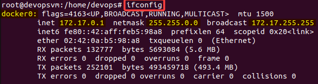

# [DOCKER NETWORK](https://docs.docker.com/engine/reference/commandline/network/)

docker container seviyesinde network yönetmek için kullanılır.\
Ethernet Bridge arayüzü **docker0** adıyla gelir. Host tarafından docker0 kontrol edilerek görüntülenebilir.

## DOCKET NETWORK TİPLERİ

### **1. bridge**
IP, subnet ve gateway otomatik olarak container a atanır. container dış dünya ile host üzerinden internet ile haberleşebilir. Ancak dış dünyadan bu container a erişilebilmesi için port yönlendirmesi yapılması gerekir.\
**NOT**:*bridge modunda kullanılan container lar birbirleri ile haberleşebilir.*

### **2. host**
host makinesinin ip ve port bilgileri container ile paylaşılır.

### **3. none**
loopback olarak kullanılmasını sağlar. Bu durumda container diğer containerlar ve dış dünya ile iletişim kuramaz.

| Command        | Description |
| -------------- | ----------- |
| `docker network ls`  | Varolan networkleri listeler. [docker network ls](https://docs.docker.com/engine/reference/commandline/network_ls/) **NETWORK ID** : Kullanılan ağ arayüzünün kimliğini belirtir.  **NAME**: Ağ arayüzünün adı **DRIVER**:Ağ arayüzünün hangi tipte olduğunu belirtir. *Varsayılan olarak **bridge** mod kullanılır. **host** ve **none** ile değiştirilebilir.* **SCOPE**: local,globalve swarm değerini alır. Ağ arayüzünün seviyesini gösterir. |
| `docker network create --driver ipvlan net_intranet`   `docker network create \` `--driver=bridge \` `--subnet=172.28.0.0/16 \` `--ip-range=172.28.5.0/24 \` `--gateway=172.28.5.254 \` `br0`| ipvlan modunda yeni bir ağ oluşturmak için kullanılır. [docker network create](https://docs.docker.com/engine/reference/commandline/network_create/) |
| `docker network inspect br0`| br0 isimli network hakkında json formatında detaylı bilgi verir. [docker network inspect](https://docs.docker.com/engine/reference/commandline/network_inspect/) |
| `docker network connect br0 c_centos`| Belirtilen containerı belirtilen networke bağlar. Otomatik olarak ip adresi sistem tarafından verilir. [docker network connect](https://docs.docker.com/engine/reference/commandline/network_connect/)|
| `docker network disconnect bridge c_centos`|Bridge networkünden belirtilen konteynerın network bağlantısını iptal eder. [docker network disconnect](https://docs.docker.com/engine/reference/commandline/network_disconnect/)|
| `docker network rm br0`|Varolan ağı siler. Silinmesi için herhangi bir container e connect olmaması gereklidir. [docker network rm](https://docs.docker.com/engine/reference/commandline/network_rm/)|
| `docker container inspect c_ubuntu \| grep IPAd`|Belirtilen container a ait ip adreslerini kısadan yoldan listeler. [docker container inspect](https://docs.docker.com/engine/reference/commandline/container_inspect/)|

## ORNEK
> c_centos container ına br0 networkü bağlamak.\
`docker network create --driver=bridge --subnet=172.28.0.0/16 --ip-range=172.28.5.0/24 --gateway=172.28.5.254 br0`\
`docker network connect br0 c_centos`\
`docker container inspect c_centos`\

Örnek networkler yaratıp containerlar aynı networkte ise birbirleri ile haberleştiğinin kanıtı aşağıdadır.
>`docker network create netbridge1`\
`docker network create netbridge2`\
`docker container run --name c_ubuntu --network netbridge1 -ti -d ubuntu bash`\
`docker container run --name c_nginx --network netbridge2 -d nginx`\
`docker attach c_ubuntu`\
`apt-get install iputils-ping`\
`ping c_nginx`

IPAddress shell üzerinden öğrenme iki farklı yol.
>`docker inspect --format='{{range.NetworkSettings.Networks}}{{.MacAddress}}{{end}}' c_ubuntu`\
`docker inspect --format='{{range.NetworkSettings.Networks}}{{.IPAddress}}{{end}}' c_ubuntu`

>`docker container inspect c_ubuntu`

