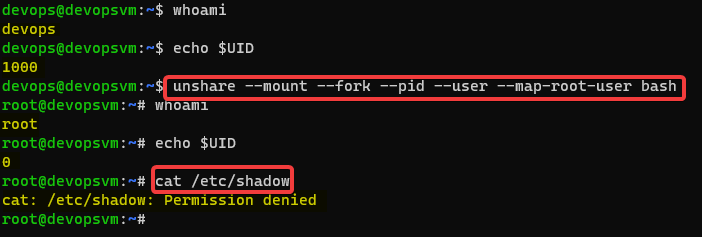
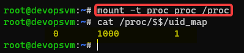
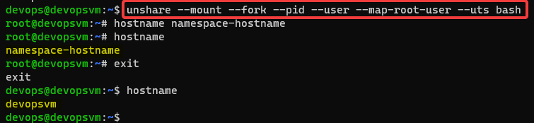

# NAMESPACE KAVRAMI

s

## 1. AĞ İZOLASYONU (YALITIMI)
`ip addr` \
`sudo ip netns add izolenet-ns` \
`sudo ip netns list` \
`sudo ip netns exec izole-ns ip addr` \
 \
`sudo ip netns exec izole-ns ping 127.0.0.1` \
`sudo ip netns exec izole-ns ip link set lo up` -> izole loopback açılması \
`sudo ip netns exec izole-ns ip addr`\
 \
`sudo ip netns exec izole-ns ping 127.0.0.1` -> loopback açık olduğunun sınanması \
`sudo ip link add sanal0 type veth peer name sanal1` -> bir kablo yaratıp bir ucunu sanal0 diğer ucunu sanal1 diye isimlendirdiğimizi düşünün. \
`ip addr` \
 \
`sudo ip link set sanal0 netns izolenet-ns` -> sanal0 ucunu izolenet-ns ağına üye ettik \
 \
`sudo ip netns exec izolenet-ns ip addr`\
 \
`sudo ip addr add 10.0.10.1/24 dev sanal1` \
`sudo ip netns exec izolenet-ns ip addr add 10.0.10.2/24 dev sanal0` \
`sudo ip netns exec izolenet-ns ip addr` \
`sudo ip link set sanal1 up` \
`sudo ip netns exec izolenet-ns ip link set sanal0 up`\
`ping 10.0.10.1` \
`ping 10.0.10.2` \
`sudo ip netns exec izolenet-ns ping 10.0.10.1` \
`sudo ip addr del 10.0.10.1/24 dev sanal1` -> sadece ping atılabildiğinin denenmesi içindi sildik.\
Burada sanal1 kablo ucunu `bridge` köprü network üzerine aktaracağız \
`sudo ip link add kopru0 type bridge` \
`sudo ip link set sanal1 master kopru0` \
`sudo ip addr add 10.0.10.1/24 dev kopru0` \
`sudo ip link set kopru0 up` \
`sudo ip link set sanal1 up` \
`sudo ip netns exec izolenet-ns ping 10.0.10.1` \
`sudo ip netns exec izolenet-ns ping 10.0.10.1` \
`sudo ip netns exec izolenet-ns ip route add default via 10.0.10.1` \
`sudo ip netns exec izolenet-ns ping 8.8.8.8` -> halen içeriden dışarıya ping atamıyoruz bunun nedeni dönüş paketlerinin yönlendirilmemesi.
`echo '1' | sudo tee /proc/sys/net/ipv4/ip_forward` \
`ip addr` -> dış bacağımızın ismine bakıyoruz. \
`sudo iptables -t nat -A POSTROUTING -o kopru0 -j MASQUERADE` \
`sudo iptables -t nat -A POSTROUTING -o <dış bacak ismi> -j MASQUERADE` \
`sudo ip netns exec izolenet-ns ping 8.8.8.8` \

İzole bir network yaratıp onun içerisindeki bir makinenin dış ortamla nasıl haberleştiğinin bir simülasyonunu yaptık. Docker bütün bunları bizim için otomatik olarak yapıyor.

## 2. PID İsim Alanları
`python3 &> /dev/null &` \
`ps aux | grep python3` \
`kill -9 6823` \
`sudo unshare --fork --pid bash` \
`python3 &> /dev/null &` \
`sudo unshare --fork --pid bash` \

`mount -t proc proc /proc` -> PID değerlerinin doğru şekilde gösterilmesi.
`ps`

Ancak bunu yapmak zahmetlidir. Bunun yerine 
`sudo unshare --fork --pid --mount-proc bash` \
`ps` \

## 3. Kullanıcı İsim Alanı
`unshare --mount --fork --pid --user bash` \
 \
nobody kullanıcısı ile devops kullanıcısı aynı haklara sahip iki kullanıcıdır ancak unshare komutu ile yalıtılmış bir ortam oluşturarak 65534 UID yi arka tarafta 1000 e çevirerek işlem yapacaktır.

`unshare --mount --fork --pid --user --map-root-user bash` \

Hernekadar root kullanıcısı olarak görüntülense /etc/shadow klasörü altına erişim izni bulunmamaktadır. \

 \

Aktif terminal üzerindeki 0 UID li kullanıcının aslında ana sistem üzerinde (bir üst isim alanında - namespace) 1000 uid li kullanıcı olduğunu görmüş oluyoruz. 

## UTS (Unix Time Sharing System) İSİM ALANI
hostname değiştirme için kullanılır.
`unshare --mount --fork --pid --user --map-root-user --uts bash` \
 \

## 4. IPC (Inter Process Communication)

## 5. cgroups
Uygulamaların işlemci, ram kullanımlarının sınırlanması yoğun kullanım durumlarında darboğazları önleyici bir etkisi bulunmaktadır. Bu durumda cgroups kullanılabilir. Kullanılabiliecek komutlar cgcreate, cgdelete, cgexec kullanılabilir. Linux kontrol grupları...

## UNION Dosya sistemi
Birden fazla dizini tek bir dizin gibi gösteren dosya sistemlerine Union file system denir. Bu amaçla kullanılan `aufs, UnionFS, OverlayFS` dosya sistemleri kullanılmaktadır.

CoW (copy-on-write) dosya değiştiinde önceki halinin korunduğu değişen dosyanın farklı bir yere yazılır. Yani dosya üzerinde değişiklik yapılıp kaydedildiğinde dosyanın bir kopyası oluşturulur. Bu özellik container lerin tek bir imaj üzerinden işlem yapmasını sağlayan ve container içerisinde sadece değişen kısımların imajdan bağımsız olarak tutulmasını sağlar. Ayrıca birden fazla aynı imaj üzerinde container oluşturulmaya çalışıldığında imaj kopyalama işlemi olmayacağı için çok hızlı sistemin açılmasına (container in ayağa kaldırılmasına) olanak sağlar. 

Image lerin katmanlı yapısı ile UNION dosya sistemi bir arada düşünüldüğünde aynı temeli alan farklı imajların ortak katmanlarının diskte tek bir tane depolanması ve iyi bir optimizasyon oluşturur.